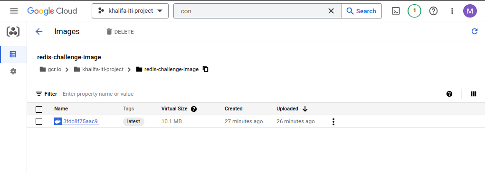
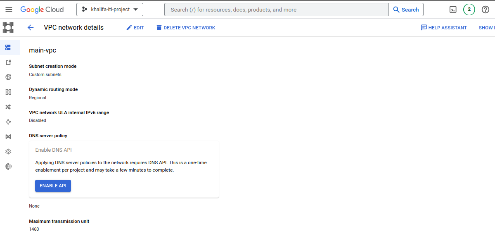
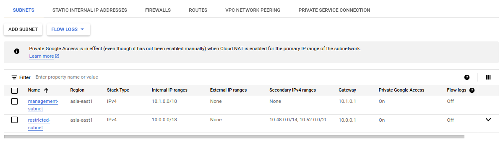
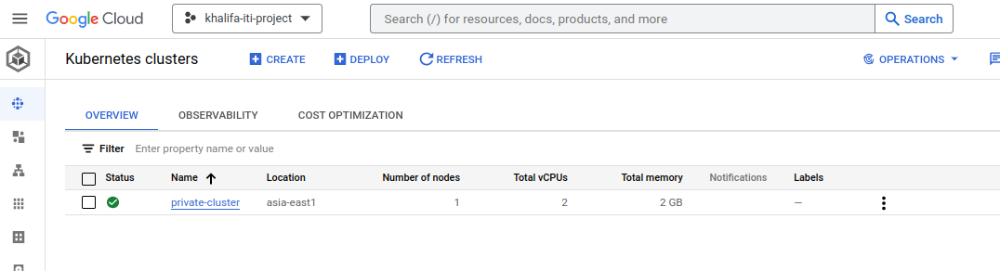
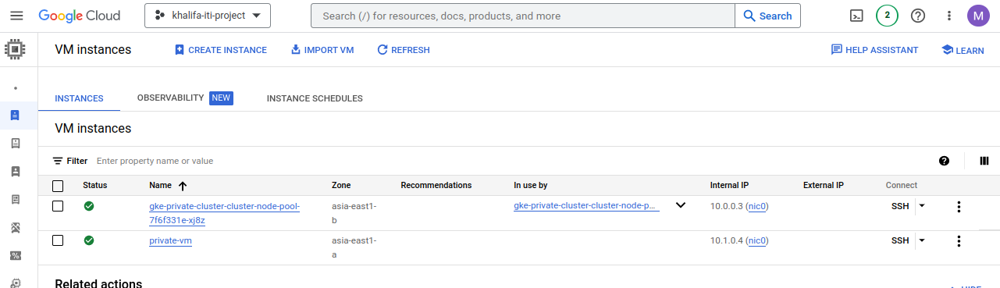

# Gcp-Cluster-Project
<hr>

### Project Description
#### Build infrastructure by terraform consists of vpc and two subnet
#### - VPC contains:
 1. Management subnet has the following:
    • NAT gateway
    • Private VM

  2. Restricted subnet has the following:
     • Private standard GKE cluster (private control plan) 
#### -Constraints:
  1. Restricted subnet must not have access to internet
  2. All images deployed on GKE must come from GCR or Artifacts registry.
  3. The VM must be private.
  4. Deployment must be exposed to public internet with a public HTTP load balancer.
  5. All infra is to be created on GCP using terraform.
  6. Deployment on GKE can be done by terraform or manually by kubectl tool.
  7. The code to be build/dockerized and pushed to GCR is on here: https://github.com/atefhares DevOps-Challenge-Demo-Code
  8. Don’t use default compute service account while creating the gke cluster, create custom SA and attach it to your nodes.
  9. Only the management subnet can connect to the gke cluster.

<hr>

### First
clone the repo from https://github.com/atefhares DevOps-Challenge-Demo-Code
create Dockerfile to build the image and push it to GCR
build the repo with command:
```bash
docker build -t gcr.io/khalifa-iti-project/devops-challenge-image .
```


then push this image to GCR:
```bash
docker push gcr.io/khalifa-iti-project/devops-challenge-image
```


create redis-dockerfile to build redis image and push it to GCR
```bash
docker build -t gcr.io/khalifa-iti-project/redis-challenge-image -f redis-dockerfile .
docker push gcr.io/khalifa-iti-project/redis-challenge-image
```




### Second
setup the infrastructure by run this commands respectively:
```bash
terraform init //to initialize the infrastructure
terraform plan //to plan the infrastructure and check if there is any errors
terraform apply // to apply the infrastructure to GCP
```

### Finally







