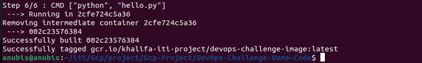
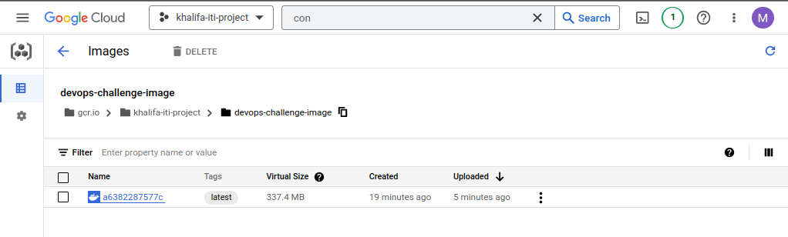
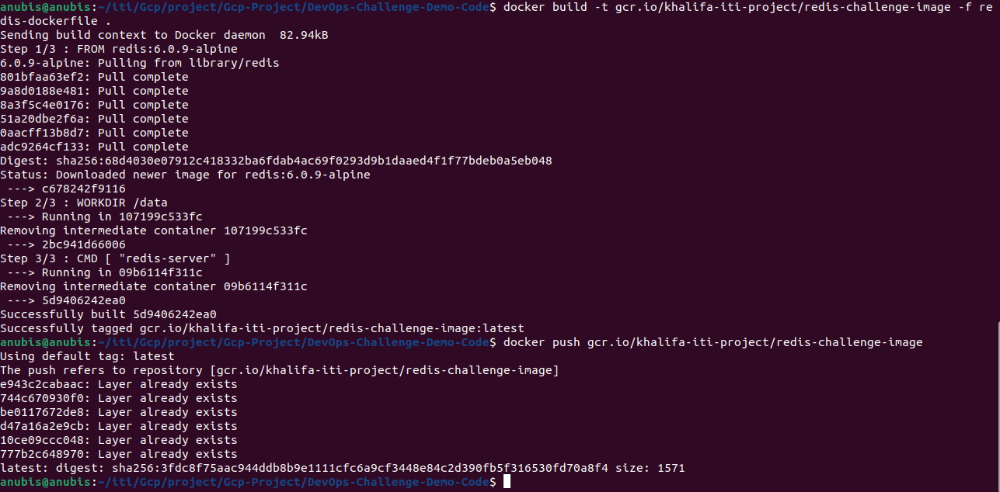

# Gcp-Project
<hr>

build the repo with command:
```bash
docker build -t gcr.io/khalifa-iti-project/devops-challenge-image .
```


then push this image to GCR:
```bash
docker push gcr.io/khalifa-iti-project/devops-challenge-image
```



```bash
docker build -t gcr.io/khalifa-iti-project/redis-challenge-image -f redis-dockerfile .
docker push gcr.io/khalifa-iti-project/redis-challenge-image
```


